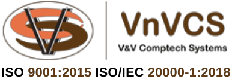

## About Project

VNVCS is a leading IT solutions company in India, specializing in providing innovative solutions for the logistics and supply chain industry. With a focus on the Ports, Shipping, and Logistics vertical, VNVCS has assembled a team of IT professionals with domain expertise to develop and implement cutting-edge software solutions.

Some of the key features of VNVCS include:

- **Application Software**: VNVCS designs, develops, implements, and supports application software for terminal operations, offering a comprehensive solution for managing logistics and supply chain processes.
- **Satisfied Clients**: VNVCS has received positive feedback from clients, with testimonials expressing satisfaction with the solutions offered and the successful implementation and training provided by the company.
- **Integration**: VNVCS's terminal billing application is integrated with NAVIS N4 solution, ensuring seamless data flow and efficient billing processes.
- **Domain Knowledge**: VNVCS has a strong understanding of the Ports, Shipping, and Logistics vertical, enabling them to provide tailored solutions that meet the unique needs of their clients.

For more information about VNVCS and their IT solutions for the logistics and supply chain industry, you can visit their website at [vnvcs.com](https://vnvcs.com).

Citations:
[1] https://vnvcs.com
[2] https://www.linkedin.com/pulse/tales-interesting-projects-vnvcs-vnvcs-skjic?trk=public_post_main-feed-card_feed-article-content
[3] https://www.youtube.com/watch?v=D164l1E0eWY
[4] https://www.datanyze.com/companies/vnvcs-services/346733616
[5] https://indiamart.com/vandv-comptech/aboutus.html

https://github.com/princeidot/vnvcs/assets/131530732/2ae3efd7-5d8f-474d-b290-47767aea9dbf

